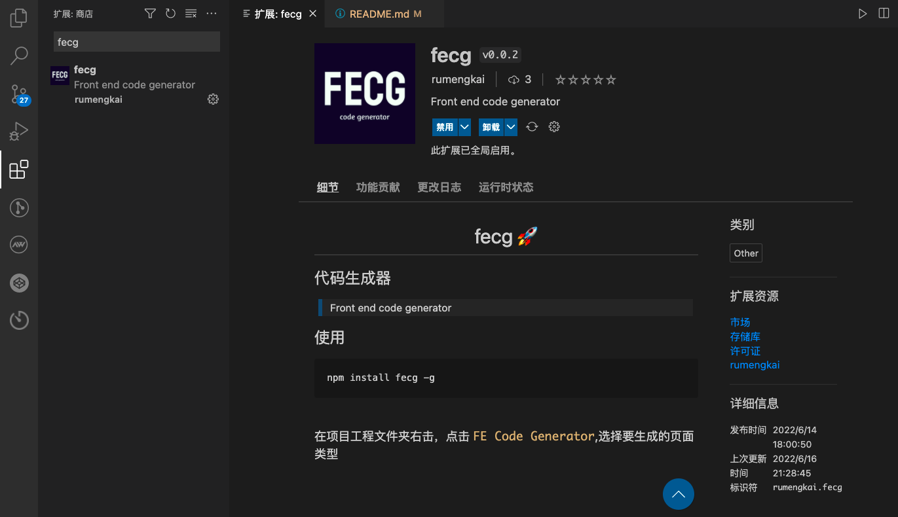

<h1 align="center">fecg 🚀</h1>

[](https://www.npmjs.com/package/fecg)


### 使用文档： [FECG](https://temp-static-domain.jd.com/fecg-docs)

## 如何安装

```bash
npm install fecg -g
```

## 如何使用
下面的命令会列出目前所有可用的生成器，可以通过交互式方式来选择你使用的功能，都有详细的提示。

```bash
$ fe
❯ list - 列表页面 
  form - 表单页面 
  page - 空白页面 
  api - 生成 api 文件 
  mock - 生成单个 mock 文件 
  openapi - 根据swagger openapi3 生成 server 
```

你也可以通过 fe \<generatorName\> name 的形式来使用对应的生成器。 --dir 参数代表输出文件的路径

```bash
$ fe list basic-table userList --dir src/pages
✔  ++ ./src/pages/userList/index.tsx
```

或者使用 fe -h 查看帮助

```bash
$ fe -h

Usage:
  $ fe                 Select from a list of available generators
  $ fe <name>          Run a generator registered under that name
  $ fe <name> [input]  Run the generator with input data to bypass prompts

Options:
  -h, --help             Show this help display
  -t, --show-type-names  Show type names instead of abbreviations
  -i, --init             Generate a basic plopfile.js
  -v, --version          Print current version
  -f, --force            Run the generator forcefully
  -d, --dir              Enter folder path

 ------------------------------------------------------


Examples:
  $ fe
  $ fe list
  $ fe list basic-table
  $ fe list basic-table userList --dir src/pages
```

## 配合 vscode 插件使用：[fecg-vscode](https://marketplace.visualstudio.com/items?itemName=rumengkai.fecg)




### 配置文件，
## 如果要使用 openapi 功能，需要在项目根路径增加配置文件：fecg.config.js
> fecg.config.js

```js
module.exports = {
  openapi: {
    schemaPath: "https://gw.alipayobjects.com/os/antfincdn/M%24jrzTTYJN/oneapi.json", // schema 地址
    requestLibPath: "import request from '@/utils/request';", // 请求头设置
    serversPath: "./src/servers", // server文件输出目录
    mockFolder: "./src/mock/api", // mock文件输出目录
    // apiPrefix: '',  // api请求地址前缀
  },
};
```

# 增加模板文件
> 注意 src/templates/data.json 中的 name 的值需要与对应 templates 文件夹一致

### 目录结构

```
├── src // 公用组件
│   ├── templates // 模板文件
│   │   ├── form
│   │   ├── table
│   │   └── data.json // plop 模板映射列表
│   ├── plop // plop 控制器
│   │   ├── form.ts
│   │   └── table.ts
│   ├── index.ts // cli 入口文件
│   ├── plopfile.ts // plop 入口文件
│   └── utils // 公共方法
└── fecg.config.js  // 配置文件
```

## 开始开发

```sh
# 启动项目
npm run dev
# 测试指令
npm run fe
# 构建打包
npm run build
```

## 相关资料

- 脚手架 [plopjs](https://plopjs.com/)
- 模板引擎：[handlebarsjs](https://handlebarsjs.com/zh/)
