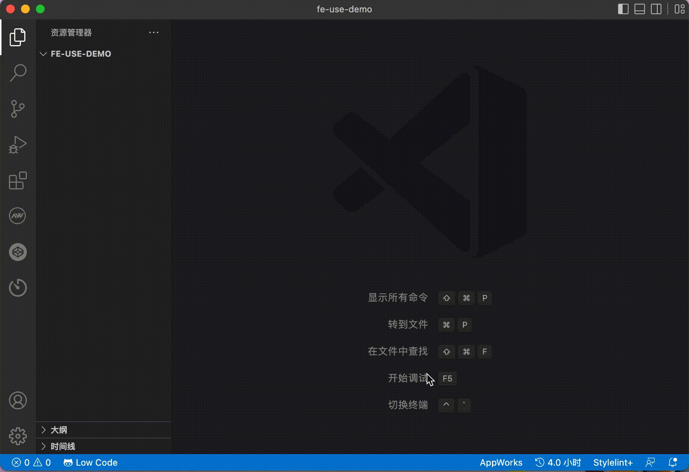

<h1 align="center">fecg 🚀</h1>
<p>
  
  
  <a href="#" target="_blank">
    
  </a>
</p>


> Front end code generator

## 代码生成器

直接全局安装 [fecg](https://www.npmjs.com/package/fecg)

```sh
npm install fecg -g
```

OR

```sh
npm install @jd/fecg -g --registry=http://registry.m.jd.com
```

```
fe -h
```

## 配合 vscode 插件使用：[fecg-vscode](https://marketplace.visualstudio.com/items?itemName=rumengkai.fecg)



### 配置文件，

> fecg.config.js

```js
module.exports = {
  // 如果要使用openapi功能，需要配置openapi信息
  openapi: {
    schemaPath: "https://gw.alipayobjects.com/os/antfincdn/M%24jrzTTYJN/oneapi.json", // schema 地址
    requestLibPath: "import request from '@/utils/request';", // 请求头设置
    serversPath: "./src/servers", // server文件输出目录
    mockFolder: "./src/mock/api", // mock文件输出目录
    // apiPrefix: '',  // api请求地址前缀
  },
};
```

# 增加模板文件

### 目录结构

```
├── src // 公用组件
│   ├── templates // 模板文件
│   │   ├── form
│   │   ├── table
│   │   └── data.json // plop 模板映射列表
│   ├── plop // plop 控制器
│   │   ├── form.ts
│   │   └── table.ts
│   ├── index.ts // cli 入口文件
│   ├── plopfile.ts // plop 入口文件
│   └── utils // 公共方法
└── fecg.config.js  // 配置文件
```

## 开始开发

```sh
# 启动项目
npm run dev
# 测试指令
npm run fe
# 构建打包
npm run build
```

## 相关资料

- 脚手架 [plopjs](https://plopjs.com/)
- 模板引擎：[handlebarsjs](https://handlebarsjs.com/zh/)
